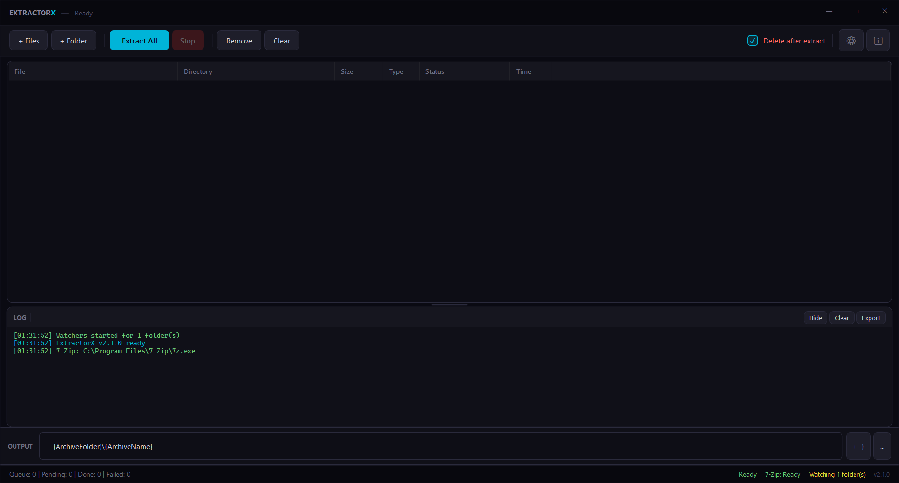

<p align="center">
  
  
  
  
  
</p>

<h1 align="center">EXTRACTOR<span style="color:#00B4D8">X</span></h1>

<p align="center">
  <strong>Open-source bulk archive extraction tool for Windows</strong><br>
  <em>Inspired by <a href="https://extractnow.com">ExtractNow</a> by Nathan Moinvaziri</em>
</p>

<p align="center">
  Drag-and-drop batch extraction with password cycling, nested archive support,<br>
  directory monitoring, and a premium themed interface. Ships as a modular Python/Tkinter<br>
  app with a preserved legacy PowerShell/WPF version.
</p>

---




## Features

### Core Extraction
- **Batch extraction** — queue hundreds of archives and extract them all at once
- **29 archive formats** — ZIP, 7Z, RAR, TAR, GZ, BZ2, XZ, ZSTD, ISO, CAB, ARJ, LZH, WIM, CPIO, RPM, DEB, and more
- **Multi-volume archive detection** — automatically groups split archives (`.part1.rar`, `.7z.001`, etc.) and only extracts the first volume
- **Nested extraction** — recursively extracts archives within archives up to configurable depth
- **Password cycling** — automatically tries a stored password list against encrypted archives (DPAPI encrypted storage with application-specific entropy)
- **Hash-mode password probe** — uses fast `7z t` testing to find the correct password before full extraction
- **Password sidecar files** — reads `archive.pwd.txt` or `passwords.txt` next to the archive
- **Regex password rules** — map filename patterns to specific password lists
- **Wordlist generation** — expands passwords with case, leet-speak, and date-suffix permutations
- **Deep archive detection** — identifies archives by magic bytes when file extensions are missing or wrong
- **Parallel extraction** — configurable thread pool for concurrent archive processing
- **Retry with backoff** — configurable retry count and delay for failed extractions
- **Archive format conversion** — right-click Convert to ZIP/7z/TAR (repack)
- **Archive content preview** — list archive contents without extracting
- **Archive search** — grep inside queued archives without extracting
- **Archive diff** — compare two archives' contents side by side
- **Hex view** — inspect raw archive bytes
- **Archive browser** — selective extraction of individual files from preview

### Interface
- **5 themes** — Midnight, Graphite, Ocean, White, and High Contrast with live reload
- **Dark title bar** — automatic DwmSetWindowAttribute dark chrome for dark themes
- **System theme detection** — detects Windows dark/light mode on first launch
- **Color-coded status rows** — green (success), red (failed), blue (extracting), yellow (password required), gray (queued)
- **Drag & drop** — drop files or entire folders onto the window to queue archives
- **Taskbar progress** — extraction progress reflected in the Windows taskbar icon via ITaskbarList3
- **Per-file progress** — progress bar updates within each archive extraction
- **ETA and throughput** — shows MB/s and estimated time remaining during batch extraction
- **Column sorting** — click any column header to sort ascending/descending
- **Selection info** — status bar shows count and total size of selected items
- **System tray** — minimizes to tray with live extraction status and context menu
- **Completion sounds** — audible notification on batch success or failure
- **Keyboard shortcuts** — Ctrl+O (add), Ctrl+E (extract), Ctrl+S (export), Delete, Enter, Escape
- **File integrity hash** — SHA-256 display via queue context menu
- **Export Script** — generate portable 7z batch commands for the current queue

### Automation
- **Watch folders** — monitor directories for new archives and extract automatically
- **Watch-folder rules** — per-path output template and post-action overrides
- **Headless daemon mode** — `--daemon` flag for watch-folder-only operation without GUI
- **Windows Explorer context menu** — right-click integration for Extract Here, Extract to Folder, Add to Queue, and Search for Archives
- **Per-extension file associations** — toggle associations per format in Settings > Explorer
- **External processors** — route specific file extensions to custom commands after extraction
- **Pre/post/on-failure lifecycle hooks** — run shell commands at extraction lifecycle events
- **Plugin SDK** — custom Python post-processors in `%APPDATA%/ExtractorX/plugins/`
- **Output path macros** — template-based output paths with `{ArchiveFolder}`, `{ArchiveName}`, `{Date}`, `{Guid}`, and more
- **Webhook notifications** — JSON POST on extraction success/failure via `WebhookUrl` config
- **Export history** — extraction history as CSV/JSON

### Security
- **Minimum 7-Zip version enforcement** — warns when 7-Zip is below 26.02 (CVE-2026-48095)
- **Zip-slip defense** — post-extraction path validation with remediation (escaped files deleted)
- **Decompression bomb detection** — configurable ratio limit with automatic cleanup
- **Mark-of-the-Web propagation** — Zone.Identifier ADS copied from source archive to extracted files, including nested archives
- **Filename sanitization** — strips Unicode bidi control characters, prefixes reserved names, warns on MAX_PATH
- **Reparse point detection** — symlinks and junctions flagged and removed from extracted output
- **Quine archive detection** — nested extraction detects self-referencing archives via SHA-256 chain
- **DLL sideloading warning** — alerts when extracted directory contains both .exe and .dll files
- **Secure source deletion** — zero-overwrite before unlinking source archives
- **Disk space check** — warns before extraction when archive size exceeds available free space
- **Codepage auto-detection** — detects CJK/Cyrillic encodings for cross-locale ZIP filenames

### Post-Extraction
- **Post actions** — do nothing, recycle, move to folder, or permanently delete source archives after success
- **Smart Extract** — Auto/AlwaysWrap/NeverWrap policies for output folder structure
- **Duplicate folder removal** — eliminates the redundant `archive/archive/` nesting pattern
- **Single file rename** — renames lone extracted files to match the archive name
- **Broken file cleanup** — optionally deletes output when extraction fails

## Requirements

- **Windows 10/11** with PowerShell 5.1+ for the legacy WPF app
- **Python 3.12+** for the modular Python port
- **7-Zip 26.02+** — auto-detected from standard install paths, or downloaded automatically if not found

The Python port uses the standard library only and does not require third-party packages.

## Installation

### Option 1: Direct Download
Download [`ExtractorX.ps1`](ExtractorX.ps1) and run it:

```powershell
.\ExtractorX.ps1
```

### Option 2: Clone
```bash
git clone https://github.com/SysAdminDoc/ExtractorX.git
cd ExtractorX
python ExtractorX.py
```

### Execution Policy
If PowerShell blocks the script, run once:
```powershell
Set-ExecutionPolicy -Scope CurrentUser -ExecutionPolicy RemoteSigned
```

## Usage

### Quick Start
1. Run `python ExtractorX.py` for the Python port, or `ExtractorX.ps1` for the legacy WPF app
2. Drag archives onto the window, or click **Add Files** / **Scan Folder**
3. Click **Extract**

### Python Port

The Python implementation is organized into modules under `extractorx/`:

```text
ExtractorX.py              # Python entrypoint
extractorx/
  __init__.py              # Package init (__version__)
  __main__.py              # python -m extractorx launcher
  app.py                   # CLI parser and bootstrap
  config.py                # Config defaults, normalization, persistence
  archive.py               # Archive detection, magic bytes, output paths
  extractor.py             # 7-Zip extraction service with parallel pool
  sevenzip.py              # 7-Zip discovery, version check, command builder
  passwords.py             # DPAPI password store + wordlist generator
  postprocess.py           # Cleanup, Smart Extract, MotW, sanitization
  hooks.py                 # Pre/post/on-failure lifecycle hooks
  plugins.py               # Plugin SDK for custom post-processors
  repack.py                # Archive format conversion
  scanner.py               # Folder scanning with symlink protection
  watcher.py               # Dependency-free watch-folder service
  daemon.py                # Headless daemon mode (--daemon)
  download.py              # URL download helper + update checker
  identify.py              # Archive format identification
  shell_integration.py     # Explorer context menu registry integration
  windows_integration.py   # Native drag/drop, tray, taskbar progress
  settings_ui.py           # 9-tab settings dialog
  themes.py                # 5 theme palettes
  ui.py                    # Tkinter desktop interface
```

Run it with:

```bash
# GUI mode
python ExtractorX.py
python -m extractorx

# CLI extraction
python ExtractorX.py --extract-here --auto-extract "C:\Downloads\archive.zip"

# Pattern-scoped extraction
python ExtractorX.py --include-glob "*.json;*.md" --exclude-glob "*.tmp" archive.zip

# Headless daemon mode (watch folders only)
python ExtractorX.py --daemon

# Identify archive format
python ExtractorX.py --identify archive.bin
```

Install as a package (optional):

```bash
pip install .
extractorx
```

Tests:

```bash
python -m unittest discover -s tests
```

### Command Line (PowerShell)
```powershell
# Extract specific files
.\ExtractorX.ps1 "C:\Downloads\archive.7z" "C:\Downloads\backup.rar"

# Extract to a specific directory
.\ExtractorX.ps1 -TargetPath "D:\Extracted" "C:\Downloads\*.zip"

# Start minimized to tray
.\ExtractorX.ps1 -minimizetotray
```

### Output Path Macros

| Macro | Description |
|---|---|
| `{ArchiveFolder}` | Directory containing the archive |
| `{ArchiveName}` | Archive filename without extension (compound `.tar.*` aware) |
| `{ArchiveNameUnique}` | Archive name with `(N)` counter appended when the target path already exists |
| `{ArchiveExtension}` / `{ArchiveExt}` | Archive file extension without the leading dot |
| `{ArchiveFileName}` | Full archive filename with extension |
| `{ArchiveFolderName}` | Name of the parent folder |
| `{ArchivePath}` | Absolute archive path |
| `{Desktop}` | User's Desktop path |
| `{UserProfile}` | User's profile directory |
| `{Program Files}` / `{ProgramFiles}` | `%ProgramFiles%` directory |
| `{Windows}` | `%windir%` |
| `{Guid}` | Random 8-character GUID segment |
| `{Date}` | Current date (yyyyMMdd) |
| `{Time}` | Current time (HHmmss) |
| `{Env:TEMP}` | Any environment variable, e.g. `{Env:TEMP}`, `{Env:OneDrive}` |

**Default:** `{ArchiveFolder}\{ArchiveName}` — extracts next to the archive into a folder matching its name.

### Context Menu Integration
Enable in **Settings > Explorer** to add right-click options for archives and folders in Windows Explorer. Per-extension file association toggles let you control which formats are registered.

### Watch Folders
Add directories in **Settings > Monitor** to automatically detect and extract new archives as they appear. Per-path rules can override the output template and post-action. Use `--daemon` for headless operation.

### Password Management
Add passwords in **Settings > Passwords**. Passwords are encrypted with Windows DPAPI (with application-specific entropy) and stored locally. ExtractorX cycles through the list automatically when it encounters an encrypted archive. Import from a text file (one password per line) for bulk loading. Regex rules can map filename patterns to specific password lists.

## Settings

ExtractorX has 9 settings tabs:

| Tab | Controls |
|---|---|
| **General** | Theme selection, always on top, minimize to tray, log history, deep detection, auto-update check |
| **Destination** | Output path template, overwrite mode |
| **Process** | Nested extraction depth, parallel workers, retry count/delay, post-actions, cleanup, Smart Extract policy, batch completion behavior |
| **Monitor** | Watch folder list, per-path rules, auto-extract toggle |
| **Passwords** | Password list management, import, cycling behavior, skip-after-N policy, regex rules, sidecar files, wordlist generation |
| **Files** | File exclusion masks, drag & drop filter type/masks, handler allowlist |
| **Explorer** | Context menu entries and grouping, per-extension file association toggles |
| **Advanced** | Thread priority, sounds, external processors, lifecycle hooks, filename encoding, decompression ratio limit, disk space check, MotW propagation, secure delete, webhook URL |
| **Bookmarks** | Saved output path bookmarks for quick destination switching |

Configuration is stored in `%APPDATA%\ExtractorX\config.json`. Drop a `portable.flag` file next to the script to use portable mode (`ExtractorX.data/` for config/logs).

## Supported Formats

| Category | Extensions |
|---|---|
| **Common** | `.zip` `.7z` `.rar` |
| **Tar variants** | `.tar` `.gz` `.gzip` `.tgz` `.bz2` `.bzip2` `.tbz2` `.tbz` `.xz` `.txz` `.lzma` `.tlz` `.lz` `.zst` `.zstd` `.z` |
| **Disk / Package** | `.iso` `.cab` `.wim` `.cpio` `.rpm` `.deb` |
| **Legacy** | `.arj` `.lzh` `.lha` |
| **Split volumes** | `.001` (auto-detects `.002`+ siblings) |

Multi-volume archives (`.part1.rar`, `.7z.001`, `.zip.001`) are automatically detected — only the first volume is queued, and 7-Zip handles the rest.

## Architecture

### Python Port
```
ExtractorX.py / python -m extractorx
│
├── UI Thread (Tkinter mainloop)
│   ├── ExtractorXApp (themed Tkinter window, dark title bar)
│   ├── ttk.Treeview queue (status-colored rows, column sorting)
│   ├── root.after() polling (100ms message pump)
│   ├── ITaskbarList3 COM progress bar
│   └── System tray icon (Shell_NotifyIconW via ctypes)
│
├── Extraction Thread (ExtractionService)
│   ├── 7z.exe subprocess (list args, no shell)
│   ├── Queue[OperationMessage] → UI thread
│   ├── Password cycling (hash-mode probe → verbose extract)
│   ├── Nested extraction with quine detection
│   ├── Zip-slip validation + bomb detection + MotW propagation
│   └── Post-processing (Smart Extract, hooks, plugins, webhooks)
│
├── Scan Thread (scanner.py)
│   ├── os.scandir recursive enumeration
│   ├── Magic bytes + extension detection
│   └── Symlink-loop protection
│
└── Watch Thread (watcher.py)
    ├── Polling-based file detection (3s interval)
    ├── File stability check (10 polls × 500ms)
    └── Per-path rule dispatch
```

### Legacy PowerShell App
```
ExtractorX.ps1 (single file, ~2,500 lines)
├── WPF Window (custom chrome, theme system)
├── Extraction Runspace (7z.exe + password cycling)
├── Scan Runspace (directory enumeration)
└── Watch System (FileSystemWatcher per folder)
```

## Credits

- **7-Zip** by Igor Pavlov — [7-zip.org](https://www.7-zip.org) (LGPL)
- **ExtractNow** by Nathan Moinvaziri — original inspiration for the workflow and feature set

## License

[MIT](LICENSE)
